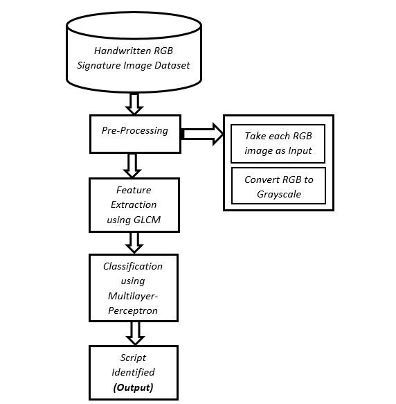

# Script-Identification-Using-Signature-Image-Texture-Analysis

## Dataset
Signature Dataset in 4 languages

## Dataset Source
Dr. SK MD Obaidullah [Google Scholars](https://scholar.google.co.in/citations?user=0V4axiUAAAAJ&hl=en)

## Feature Extraction Technique
Gray-Level Co-Occurrence Matrix (GLCM) [Link] (https://in.mathworks.com/help/images/texture-analysis-using-the-gray-level-co-occurrence-matrix-glcm.html)

## GLCM Details
- Offsets: 16
- Number of GLCM matrices: 16
- Number of features: 7
- Features: Energy, Homogeneity, Correlation, Contrast (All GLCM Properties), Entropy, MeanG, Standard Deviation
- Total no of features: 16 * 7 = 112

## Learning Algorithm
- Multilayer Perceptron
- Logistic Regression

## Identified Scripts
Bengali, English, Hindi, Urdu

## Brief Description
After importing the dataset it was converted into gray scale image from RGB image using in-built matlab function rgb2gray().The image was signature image and already cropped.That’s why in order to extract details no more pre-processing was done.After that glcm was applied and features was extracted.Then the features was delivered to multilayer perceptron algorithm, which gave the final output.

## Special Thanks
- Dr. SK MD Obaidullah [LinkedIn] (https://www.linkedin.com/in/obaidullah-sk-785712136/)
- Jipan Ali [LinkedIn] (https://www.linkedin.com/in/jipan-ali-7a46a3112/)
